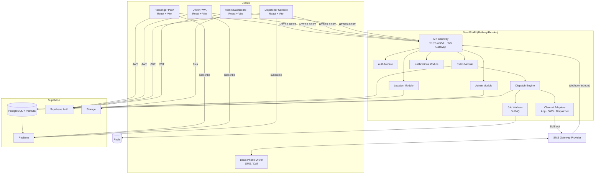
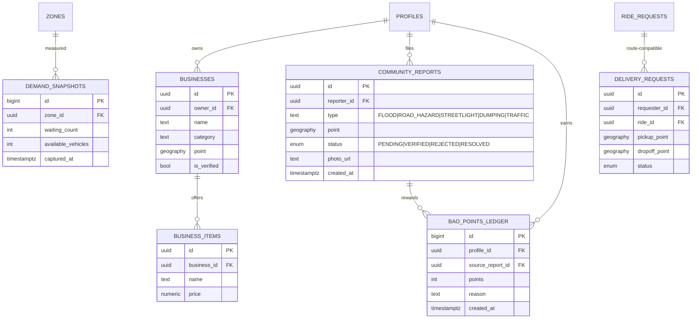
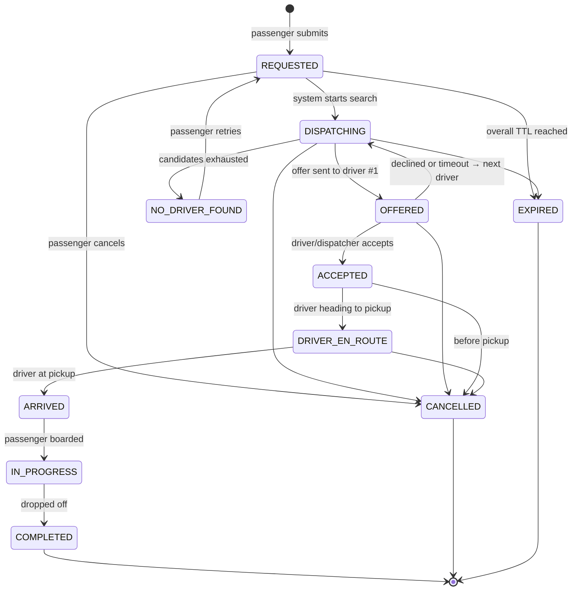
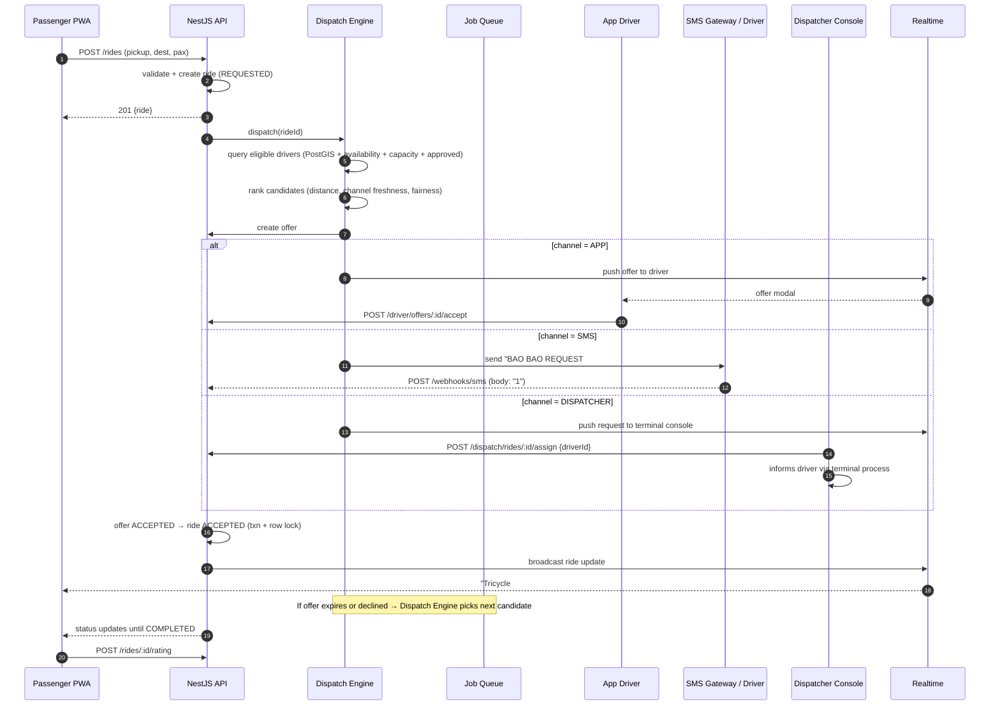
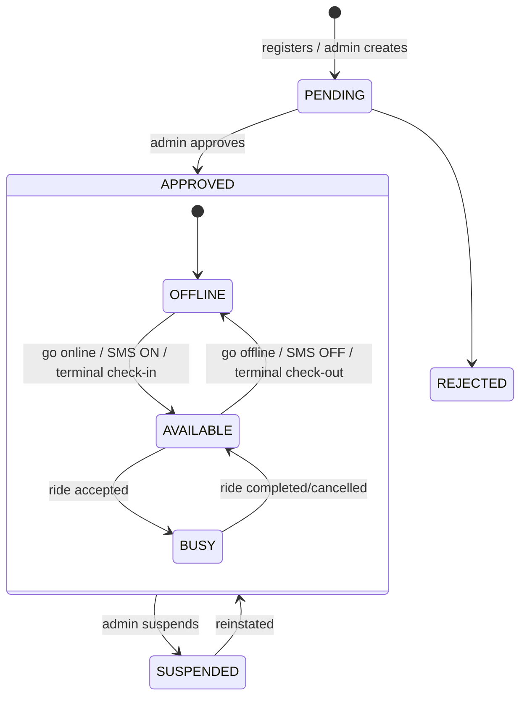
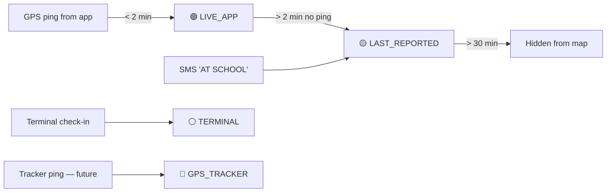

# BAO BAO — Master Plan, PRD & System Architecture
 
> Smart Community Transportation & Virtual Talibon
> Stack: **React + Vite** (frontend) · **NestJS** (backend API) · **PostgreSQL on Supabase** (database, auth, realtime, storage)
 
---
 
## Table of Contents
 
1. [Product Requirements Document (PRD)](#1-product-requirements-document-prd)
2. [Tech Stack & Key Decisions](#2-tech-stack--key-decisions)
3. [System Architecture](#3-system-architecture)
4. [Driver Channel Architecture (the 3 solutions)](#4-driver-channel-architecture-the-3-solutions)
5. [Database Design (ERD)](#5-database-design-erd)
6. [Workflow & Lifecycles](#6-workflow--lifecycles)
7. [Backend API Routes Scheme](#7-backend-api-routes-scheme)
8. [Realtime Design](#8-realtime-design)
9. [Auth, Roles & Security](#9-auth-roles--security)
10. [Frontend Architecture](#10-frontend-architecture)
11. [Project Structure (Monorepo)](#11-project-structure-monorepo)
12. [Phased Roadmap](#12-phased-roadmap)
13. [Testing, DevOps & Deployment](#13-testing-devops--deployment)
14. [Risks & Open Questions](#14-risks--open-questions)
---
 
# 1. Product Requirements Document (PRD)
 
## 1.1 Product Summary
 
**BAO BAO** connects passengers in Talibon with traditional tricycles, Bao Bao/e-tricycles, and other approved local vehicles. It reduces passenger waiting and driver empty-searching through ride requests, vehicle availability, demand visibility, and community-based dispatching.
 
**Core principle: inclusive technology.** Drivers participate through one of three channels — **App**, **SMS/Call**, or **Terminal Dispatcher**. The passenger always experiences one unified system.
 
## 1.2 Problem Statement
 
| # | Problem | Who |
|---|---------|-----|
| P1 | Passengers waste time searching/waiting for rides | Students, workers, elderly |
| P2 | Drivers waste time and fuel searching for passengers | Drivers |
| P3 | Many drivers cannot or will not use smartphone apps | Older/traditional drivers |
 
## 1.3 Goals & Non-Goals
 
**Goals (MVP)**
- G1: A passenger can request a ride and get an assigned driver.
- G2: A driver can accept via App, SMS reply, or a dispatcher on their behalf.
- G3: Honest location status (live / last reported / terminal / GPS tracker).
- G4: Admin can manage drivers, vehicles, terminals, zones and monitor rides.
**Non-Goals (MVP)**
- Online payments / fare collection
- Hardware GPS trackers
- Delivery, businesses, rewards (later phases)
- Automatic ML demand prediction
## 1.4 Personas
 
| Persona | Description | Primary Channel |
|---------|-------------|-----------------|
| **Passenger** | Student, worker, senior, visitor | Web app (PWA) |
| **App Driver** | Smartphone-capable driver | Driver app (PWA) |
| **SMS Driver** | Basic phone user | SMS / call |
| **Terminal Driver** | No phone / older driver | Dispatcher at terminal |
| **Dispatcher** | Terminal/barangay staff who assigns rides | Dispatcher console |
| **Admin** | LGU / project administrator | Admin dashboard |
 
## 1.5 User Stories (MVP)
 
**Passenger**
- As a passenger, I can register/login (phone OTP or email).
- I can see my location and nearby vehicles with a freshness label.
- I can request a ride with pickup, destination, and passenger count.
- I can see request status and the assigned driver/vehicle info.
- I can cancel before pickup.
- I can view ride history and rate/report a ride.
**App Driver**
- I can register, add my vehicle, and wait for admin approval.
- I can go online/offline and share GPS location.
- I can receive, accept or reject ride offers.
- I can update ride status (arrived, started, completed).
**SMS Driver**
- I receive an SMS offer and reply `1` (accept) or `2` (decline).
- I can optionally reply `ARRIVED` / `DONE` to update status.
- I can text `ON` / `OFF` / `AT <zone>` to report availability and location.
**Terminal Driver / Dispatcher**
- Dispatcher sees incoming requests and available drivers at their terminal.
- Dispatcher assigns a driver, confirms, and marks status on the driver's behalf.
- Dispatcher can check drivers in/out of the terminal queue.
**Admin**
- Approve/suspend drivers and vehicles.
- Manage routes, terminals, pickup zones, dispatcher accounts.
- Monitor live rides and view basic analytics.
## 1.6 Functional Requirements
 
| ID | Requirement | Phase |
|----|-------------|-------|
| FR-01 | User auth with roles (passenger, driver, dispatcher, admin) | 1 |
| FR-02 | Driver & vehicle registration with admin approval | 1 |
| FR-03 | Driver availability and location with `tracking_source` | 1 |
| FR-04 | Ride request creation with pickup/destination/pax | 1 |
| FR-05 | Dispatch engine: find eligible drivers, create offers, handle timeouts | 1 |
| FR-06 | Channel adapters: App push/realtime, SMS, Dispatcher console | 1 |
| FR-07 | Ride lifecycle state machine with audit history | 1 |
| FR-08 | Inbound SMS webhook parsing | 1 |
| FR-09 | Ratings and reports | 1 |
| FR-10 | Admin dashboard (drivers, vehicles, rides, basic stats) | 1 |
| FR-11 | Demand map and pickup zones | 2 |
| FR-12 | School rush mode and demand prediction | 2 |
| FR-13 | Shared rides, improved ETA | 2 |
| FR-14 | Business directory and Virtual Talibon map | 3 |
| FR-15 | Route-compatible delivery | 3 |
| FR-16 | Community reports and BAO Points | 4 |
 
## 1.7 Non-Functional Requirements
 
- **Performance:** ride request → first offer sent in < 5 s (p95).
- **Availability:** target 99% during 5:00–21:00 local time.
- **Low bandwidth:** PWA, small bundles, works on 3G.
- **Honesty:** never display "live" for non-live location.
- **Privacy:** minimal location retention; driver contact never exposed to the passenger without consent.
- **Localization:** English + Cebuano/Bisaya strings (i18n from day one).
- **Auditability:** every ride status change recorded with actor and channel.
## 1.8 Success Metrics
 
- Median passenger wait time (request → pickup)
- Request fulfillment rate (% not expired/no-driver)
- Driver acceptance rate by channel
- Active drivers per channel
- Empty-search reduction (survey-based, pilot)
---
 
# 2. Tech Stack & Key Decisions
 
| Layer | Choice | Notes |
|-------|--------|-------|
| Frontend | **React 18 + Vite + TypeScript** | PWA via `vite-plugin-pwa` |
| UI | Tailwind CSS + shadcn/ui | Mobile-first |
| State/Data | TanStack Query + Zustand | Server state vs. UI state |
| Maps | **Leaflet + OpenStreetMap** (or MapLibre GL) | Free, no billing; swap later if needed |
| Backend | **NestJS (TypeScript)** | Modular, DI, guards, pipes |
| ORM | **Prisma** (or TypeORM/Drizzle) | Prisma recommended for migrations + typing |
| Database | **PostgreSQL (Supabase)** + **PostGIS** | Geo queries for nearest drivers |
| Auth | **Supabase Auth** (JWT) | NestJS validates the JWT; roles in `profiles` |
| Realtime | **Supabase Realtime** + NestJS WebSocket gateway | See §8 |
| Queue/Jobs | **BullMQ + Redis** (Upstash) or `pg-boss` | Offer timeouts, retries, SMS sending |
| SMS | Local PH gateway (e.g. Semaphore) or Twilio | Pluggable `SmsProvider` interface |
| Validation | `class-validator` + `class-transformer` | Plus Zod on the frontend |
| Docs | `@nestjs/swagger` | OpenAPI at `/api/docs` |
| Hosting | Frontend: Vercel/Netlify/Cloudflare Pages · API: Railway/Render/Fly.io · DB: Supabase | |
 
### Key decisions
 
1. **NestJS owns business logic.** The frontend never writes ride state directly to Supabase; all writes go through the API. Supabase is used for DB, Auth, Realtime (read/subscribe), and Storage.
2. **PostGIS for geo.** `geography(Point,4326)` columns with GiST indexes.
3. **State machine in the service layer**, not scattered across controllers.
4. **Channel adapter pattern** so adding a GPS tracker later is a new adapter, not a rewrite.
5. **Single PWA codebase, multiple role-based route trees** (passenger / driver / dispatcher / admin) to keep MVP small. Can split later.
---
 
# 3. System Architecture
 
## 3.1 High-Level Diagram
 

 
## 3.2 NestJS Module Map
 
| Module | Responsibility |
|--------|----------------|
| `AuthModule` | JWT guard (Supabase), `RolesGuard`, current-user decorator |
| `UsersModule` | Profiles, roles |
| `DriversModule` | Driver profile, status, approval, channel preference |
| `VehiclesModule` | Vehicles, types, driver–vehicle assignment |
| `TerminalsModule` | Terminals, dispatcher membership, queue/check-in |
| `ZonesModule` | Pickup zones, routes |
| `RidesModule` | Ride request CRUD, state machine, history |
| `DispatchModule` | Candidate search, scoring, offers, timeouts, assignment |
| `ChannelsModule` | `AppChannel`, `SmsChannel`, `DispatcherChannel` adapters |
| `SmsModule` | Provider abstraction, outbound queue, inbound webhook + parser |
| `LocationModule` | Location ingestion, freshness calculation, nearby search |
| `RealtimeModule` | WS gateway / Supabase broadcast helpers |
| `RatingsModule` / `ReportsModule` | Ratings, complaints |
| `AdminModule` | Aggregates, analytics, audit log queries |
| `DemandModule` *(P2)* | Demand snapshots, hotspots, prediction |
| `CommunityModule` *(P3–4)* | Businesses, community reports, BAO Points |
 
## 3.3 Request Flow (Layering)
 
```
Controller → DTO validation → Guard (JWT+Role) → Service → Repository/Prisma → Postgres
                                                     ↓
                                              Domain Events (EventEmitter)
                                                     ↓
                               Realtime broadcast · Notifications · Jobs · Audit
```
 
---
 
# 4. Driver Channel Architecture (the 3 solutions)
 
## 4.1 Concept
 
Every driver has a **primary channel**. The dispatch engine doesn't care which; it calls a common interface.
 
```ts
interface DriverChannel {
  type: 'APP' | 'SMS' | 'DISPATCHER';
  sendOffer(offer: RideOffer): Promise<void>;
  sendRideUpdate(driverId: string, ride: Ride, event: RideEvent): Promise<void>;
}
```
 
| Channel | Offer delivery | Accept mechanism | Location source | Display label |
|---------|---------------|------------------|-----------------|---------------|
| **APP** | Realtime push + in-app modal | `POST /driver/offers/:id/accept` | GPS stream | 🟢 LIVE LOCATION |
| **SMS** | SMS via gateway | Inbound webhook reply `1` / `2` | Last SMS `AT <zone>` or last known zone | 🟡 LAST REPORTED LOCATION |
| **DISPATCHER** | Appears on dispatcher console | Dispatcher clicks Assign / Confirm | Terminal queue membership | ⚪ TERMINAL AVAILABLE |
| *(future)* **TRACKER** | Any of the above | Any | Device GPS | 🔵 GPS TRACKED |
 
## 4.2 `tracking_source` Enum (honesty rule)
 
`LIVE_APP`, `LAST_REPORTED`, `TERMINAL`, `GPS_TRACKER`, `UNKNOWN`
 
The API **always** returns `tracking_source` and `location_updated_at` with any driver/vehicle position. The UI derives the label from it. A position older than a threshold (e.g. 2 min for LIVE_APP) is downgraded to `LAST_REPORTED` automatically.
 
## 4.3 SMS Command Grammar (MVP)
 
| Inbound text | Meaning |
|--------------|---------|
| `1` | Accept the latest pending offer |
| `2` | Decline the latest pending offer |
| `ON` / `OFF` | Go available / unavailable |
| `AT <ZONECODE>` | Report location zone (e.g. `AT SCHOOL`) |
| `ARRIVED` | Arrived at pickup |
| `START` / `DONE` | Ride started / completed |
 
Rules: case-insensitive, trimmed, sender matched by `drivers.phone_number`. Unknown text → reply with help text. Offers reference a short code (e.g. `#184`) to avoid ambiguity when multiple offers exist: `1 184`.
 
---
 
# 5. Database Design (ERD)
 
## 5.1 ERD (Mermaid)
 
```mermaid
erDiagram
    PROFILES ||--o| DRIVERS : "is"
    PROFILES ||--o{ RIDE_REQUESTS : "requests"
    PROFILES ||--o{ RATINGS : "gives"
    PROFILES ||--o{ NOTIFICATIONS : "receives"
    PROFILES ||--o{ AUDIT_LOGS : "acts"
    PROFILES ||--o{ TERMINAL_DISPATCHERS : "dispatches at"
 
    DRIVERS ||--o{ DRIVER_VEHICLES : "drives"
    VEHICLES ||--o{ DRIVER_VEHICLES : "assigned"
    VEHICLE_TYPES ||--o{ VEHICLES : "categorizes"
    DRIVERS ||--o| DRIVER_LOCATIONS : "latest position"
    DRIVERS ||--o{ DRIVER_LOCATION_HISTORY : "trail"
    DRIVERS ||--o{ RIDE_OFFERS : "receives"
    DRIVERS ||--o{ TERMINAL_QUEUE : "queues"
 
    TERMINALS ||--o{ TERMINAL_DISPATCHERS : "staffed by"
    TERMINALS ||--o{ TERMINAL_QUEUE : "holds"
    ZONES ||--o{ RIDE_REQUESTS : "pickup zone"
    ZONES ||--o{ TERMINALS : "located in"
    ROUTES ||--o{ ROUTE_STOPS : "has"
    ZONES ||--o{ ROUTE_STOPS : "stop at"
 
    RIDE_REQUESTS ||--o{ RIDE_OFFERS : "offered via"
    RIDE_REQUESTS ||--o{ RIDE_STATUS_HISTORY : "logs"
    RIDE_REQUESTS ||--o| RATINGS : "rated"
    RIDE_REQUESTS ||--o{ INCIDENT_REPORTS : "reported"
    RIDE_REQUESTS }o--o| DRIVERS : "assigned driver"
    RIDE_REQUESTS }o--o| VEHICLES : "assigned vehicle"
    RIDE_OFFERS ||--o{ SMS_MESSAGES : "sent as"
 
    PROFILES {
        uuid id PK "= auth.users.id"
        text full_name
        text phone_number UK
        text email
        enum role "PASSENGER|DRIVER|DISPATCHER|ADMIN"
        text preferred_language
        bool is_active
        timestamptz created_at
    }
 
    DRIVERS {
        uuid id PK
        uuid profile_id FK "nullable for SMS/terminal-only drivers"
        text full_name
        text phone_number "nullable"
        text license_no
        enum primary_channel "APP|SMS|DISPATCHER"
        enum approval_status "PENDING|APPROVED|SUSPENDED|REJECTED"
        enum availability "OFFLINE|AVAILABLE|BUSY"
        text driver_code UK "e.g. 017"
        uuid home_terminal_id FK
        timestamptz created_at
    }
 
    VEHICLE_TYPES {
        uuid id PK
        text code UK "TRICYCLE|BAO_BAO|OTHER"
        text name
        int default_capacity
    }
 
    VEHICLES {
        uuid id PK
        uuid vehicle_type_id FK
        text plate_or_body_no UK
        int capacity
        enum approval_status
        text photo_url
        bool is_active
    }
 
    DRIVER_VEHICLES {
        uuid id PK
        uuid driver_id FK
        uuid vehicle_id FK
        bool is_current
        timestamptz assigned_at
    }
 
    DRIVER_LOCATIONS {
        uuid driver_id PK_FK
        geography point
        enum tracking_source
        uuid last_zone_id FK
        timestamptz updated_at
    }
 
    DRIVER_LOCATION_HISTORY {
        bigint id PK
        uuid driver_id FK
        geography point
        enum tracking_source
        timestamptz recorded_at
    }
 
    TERMINALS {
        uuid id PK
        text name
        uuid zone_id FK
        geography point
        bool is_active
    }
 
    TERMINAL_DISPATCHERS {
        uuid id PK
        uuid terminal_id FK
        uuid profile_id FK
    }
 
    TERMINAL_QUEUE {
        uuid id PK
        uuid terminal_id FK
        uuid driver_id FK
        int position
        timestamptz checked_in_at
        timestamptz checked_out_at
    }
 
    ZONES {
        uuid id PK
        text code UK "SCHOOL, MARKET, POBLACION"
        text name
        enum zone_type "PICKUP|TERMINAL|AREA"
        geography center
        geography boundary "polygon, optional"
        bool is_active
    }
 
    ROUTES {
        uuid id PK
        text name
        bool is_active
    }
 
    ROUTE_STOPS {
        uuid id PK
        uuid route_id FK
        uuid zone_id FK
        int stop_order
    }
 
    RIDE_REQUESTS {
        uuid id PK
        text public_code UK "e.g. 184 / short code"
        uuid passenger_id FK
        int passenger_count
        geography pickup_point
        text pickup_label
        uuid pickup_zone_id FK
        geography destination_point
        text destination_label
        enum status
        uuid driver_id FK "nullable"
        uuid vehicle_id FK "nullable"
        text channel_used "APP|SMS|DISPATCHER"
        int eta_minutes
        text cancel_reason
        timestamptz requested_at
        timestamptz expires_at
        timestamptz accepted_at
        timestamptz picked_up_at
        timestamptz completed_at
    }
 
    RIDE_OFFERS {
        uuid id PK
        uuid ride_id FK
        uuid driver_id FK
        enum channel "APP|SMS|DISPATCHER"
        enum status "PENDING|ACCEPTED|DECLINED|EXPIRED|CANCELLED"
        int sequence
        timestamptz offered_at
        timestamptz expires_at
        timestamptz responded_at
        uuid responded_by "profile id if dispatcher acted"
    }
 
    RIDE_STATUS_HISTORY {
        bigint id PK
        uuid ride_id FK
        enum from_status
        enum to_status
        uuid actor_profile_id FK
        enum actor_type "PASSENGER|DRIVER|DISPATCHER|ADMIN|SYSTEM|SMS"
        jsonb meta
        timestamptz created_at
    }
 
    SMS_MESSAGES {
        uuid id PK
        enum direction "OUT|IN"
        text phone_number
        text body
        uuid ride_offer_id FK "nullable"
        enum status "QUEUED|SENT|DELIVERED|FAILED|RECEIVED"
        text provider_message_id
        timestamptz created_at
    }
 
    RATINGS {
        uuid id PK
        uuid ride_id FK UK
        uuid passenger_id FK
        uuid driver_id FK
        int score
        text comment
        timestamptz created_at
    }
 
    INCIDENT_REPORTS {
        uuid id PK
        uuid ride_id FK
        uuid reporter_id FK
        text category
        text description
        enum status "OPEN|REVIEWING|RESOLVED"
        timestamptz created_at
    }
 
    NOTIFICATIONS {
        uuid id PK
        uuid profile_id FK
        text type
        jsonb payload
        bool is_read
        timestamptz created_at
    }
 
    AUDIT_LOGS {
        bigint id PK
        uuid actor_id FK
        text action
        text entity
        uuid entity_id
        jsonb diff
        timestamptz created_at
    }
```
 
## 5.2 Phase 2+ Tables (add later)
 

 
## 5.3 Enums
 
```sql
CREATE TYPE ride_status AS ENUM (
  'REQUESTED','DISPATCHING','OFFERED','ACCEPTED','DRIVER_EN_ROUTE',
  'ARRIVED','IN_PROGRESS','COMPLETED','CANCELLED','EXPIRED','NO_DRIVER_FOUND'
);
CREATE TYPE driver_channel AS ENUM ('APP','SMS','DISPATCHER');
CREATE TYPE tracking_source AS ENUM ('LIVE_APP','LAST_REPORTED','TERMINAL','GPS_TRACKER','UNKNOWN');
CREATE TYPE approval_status AS ENUM ('PENDING','APPROVED','SUSPENDED','REJECTED');
CREATE TYPE driver_availability AS ENUM ('OFFLINE','AVAILABLE','BUSY');
CREATE TYPE offer_status AS ENUM ('PENDING','ACCEPTED','DECLINED','EXPIRED','CANCELLED');
CREATE TYPE user_role AS ENUM ('PASSENGER','DRIVER','DISPATCHER','ADMIN');
```
 
## 5.4 Indexes & Extensions
 
```sql
CREATE EXTENSION IF NOT EXISTS postgis;
CREATE EXTENSION IF NOT EXISTS pgcrypto;
 
CREATE INDEX idx_driver_locations_point ON driver_locations USING GIST (point);
CREATE INDEX idx_ride_pickup_point      ON ride_requests   USING GIST (pickup_point);
CREATE INDEX idx_ride_status            ON ride_requests (status, requested_at DESC);
CREATE INDEX idx_ride_passenger         ON ride_requests (passenger_id, requested_at DESC);
CREATE INDEX idx_offers_ride            ON ride_offers (ride_id, sequence);
CREATE INDEX idx_offers_driver_pending  ON ride_offers (driver_id) WHERE status = 'PENDING';
CREATE INDEX idx_sms_phone              ON sms_messages (phone_number, created_at DESC);
CREATE UNIQUE INDEX uq_driver_current_vehicle ON driver_vehicles (driver_id) WHERE is_current;
CREATE UNIQUE INDEX uq_one_active_ride_per_passenger
  ON ride_requests (passenger_id)
  WHERE status IN ('REQUESTED','DISPATCHING','OFFERED','ACCEPTED','DRIVER_EN_ROUTE','ARRIVED','IN_PROGRESS');
```
 
> The partial unique index enforces **one active ride per passenger** at the database level.
 
---
 
# 6. Workflow & Lifecycles
 
## 6.1 Ride State Machine
 

 
**Transition table (enforced in `RideStateMachine`)**
 
| From | To | Allowed Actor |
|------|----|---------------|
| REQUESTED | DISPATCHING | SYSTEM |
| DISPATCHING | OFFERED | SYSTEM |
| OFFERED | ACCEPTED | DRIVER (app/SMS), DISPATCHER |
| OFFERED | DISPATCHING | SYSTEM (decline/timeout) |
| DISPATCHING | NO_DRIVER_FOUND | SYSTEM |
| ACCEPTED | DRIVER_EN_ROUTE | DRIVER, DISPATCHER, SYSTEM |
| DRIVER_EN_ROUTE | ARRIVED | DRIVER, DISPATCHER |
| ARRIVED | IN_PROGRESS | DRIVER, DISPATCHER |
| IN_PROGRESS | COMPLETED | DRIVER, DISPATCHER |
| any pre-IN_PROGRESS | CANCELLED | PASSENGER, ADMIN, DISPATCHER |
| REQUESTED/DISPATCHING | EXPIRED | SYSTEM |
 
Invalid transitions return **409 Conflict** with a clear error code (`RIDE_INVALID_TRANSITION`).
 
## 6.2 Dispatch Sequence (all three channels)
 

 
## 6.3 Dispatch Algorithm (MVP)
 
1. **Eligibility filter:** `approval_status = APPROVED` AND `availability = AVAILABLE` AND vehicle capacity ≥ pax AND not already holding a pending offer AND not previously declined this ride.
2. **Distance:** `ST_DWithin(driver.point, pickup, radius)`; start at 1.5 km, expand to 3 km, then 5 km.
3. **Candidate ranking score:**
   `score = w1·distance + w2·location_staleness_penalty + w3·idle_time_fairness + w4·channel_response_penalty`
   - Terminal drivers rank by **queue position** within their terminal (FIFO) when the pickup is within the terminal's zone.
4. **Offer one at a time** (MVP) with channel-based TTL: APP 20 s · DISPATCHER 60 s · SMS 90 s.
5. **Concurrency safety:** accepting an offer uses `SELECT ... FOR UPDATE` on the ride row; only one offer can win. Late acceptances receive "Request no longer available".
6. **Overall ride TTL:** 10 min → `EXPIRED`/`NO_DRIVER_FOUND`.
7. **Fallback:** if no automated candidate responds, escalate the ride to the **nearest dispatcher console** as a manual-assign request.
## 6.4 Driver Lifecycle
 

 
> Admin/dispatcher can **create SMS and terminal drivers on their behalf** (no app account needed), since those drivers have no `profile_id`.
 
## 6.5 Location Freshness Lifecycle
 

 
A scheduled job (every 30 s) downgrades stale `LIVE_APP` rows and auto-sets inactive drivers `OFFLINE` after a configurable idle limit.
 
## 6.6 Account Lifecycle
 
`Register → Verify (OTP/email) → Active → (Suspended) → Deactivated`. Drivers add `Approval` between Verify and Active.
 
---
 
# 7. Backend API Routes Scheme
 
**Base URL:** `/api/v1` · **Auth:** `Authorization: Bearer <Supabase JWT>` · **Format:** JSON · **Pagination:** `?page=1&limit=20` · **Errors:** `{ statusCode, code, message, details? }`
 
Legend — Roles: **P** passenger · **D** driver · **X** dispatcher · **A** admin · **Pub** public · **Sys** webhook/system
 
## 7.1 Auth & Profile
 
| Method | Route | Roles | Description |
|--------|-------|-------|-------------|
| POST | `/auth/sync` | any authed | Create/sync `profiles` row after Supabase signup |
| GET | `/me` | any | Current profile + role |
| PATCH | `/me` | any | Update name, phone, language |
| DELETE | `/me` | any | Deactivate account |
 
## 7.2 Passenger — Rides
 
| Method | Route | Roles | Description |
|--------|-------|-------|-------------|
| GET | `/vehicles/nearby?lat&lng&radius` | P | Nearby available vehicles with `tracking_source`, `location_updated_at` |
| GET | `/zones` | P, D, X | List pickup zones |
| POST | `/rides` | P | Create ride request |
| GET | `/rides/active` | P | Current active ride |
| GET | `/rides/:id` | P (own), D (assigned), X, A | Ride detail |
| GET | `/rides` | P | Ride history (own) |
| POST | `/rides/:id/cancel` | P, X, A | Cancel with reason |
| POST | `/rides/:id/retry` | P | Re-request after NO_DRIVER_FOUND |
| POST | `/rides/:id/rating` | P | Rate completed ride |
| POST | `/rides/:id/report` | P, D | Report incident |
 
**`POST /rides` body**
```json
{
  "pickup": { "lat": 10.1503, "lng": 124.3305, "label": "School Gate 2", "zoneId": "uuid?" },
  "destination": { "lat": 10.1531, "lng": 124.3350, "label": "Poblacion" },
  "passengerCount": 2,
  "notes": "optional"
}
```
 
## 7.3 Driver (App channel)
 
| Method | Route | Roles | Description |
|--------|-------|-------|-------------|
| POST | `/drivers/register` | D | Submit driver profile + vehicle for approval |
| GET | `/driver/me` | D | Driver profile, vehicle, status |
| PATCH | `/driver/me/vehicle` | D | Update vehicle details |
| POST | `/driver/status` | D | `{ availability: "AVAILABLE" \| "OFFLINE" }` |
| POST | `/driver/location` | D | `{ lat, lng, accuracy, heading? }` (rate-limited 1/5 s) |
| GET | `/driver/offers` | D | Pending offers |
| POST | `/driver/offers/:id/accept` | D | Accept offer |
| POST | `/driver/offers/:id/decline` | D | Decline offer |
| POST | `/driver/rides/:id/en-route` | D | Heading to pickup |
| POST | `/driver/rides/:id/arrived` | D | Arrived at pickup |
| POST | `/driver/rides/:id/start` | D | Passenger boarded |
| POST | `/driver/rides/:id/complete` | D | Trip complete |
| GET | `/driver/rides` | D | Driver ride history |
| GET | `/driver/demand` | D *(P2)* | Demand hotspots |
 
## 7.4 SMS Channel
 
| Method | Route | Roles | Description |
|--------|-------|-------|-------------|
| POST | `/webhooks/sms/inbound` | Sys (signature-verified) | Receive driver SMS, parse commands |
| POST | `/webhooks/sms/status` | Sys | Delivery receipts |
| GET | `/admin/sms` | A | SMS log (debug/audit) |
| POST | `/admin/sms/test` | A | Send test SMS |
 
Inbound handler pipeline: **verify signature → normalize phone (+63) → find driver → parse command → call same services as the app endpoints → send confirmation SMS**.
 
## 7.5 Dispatcher Console (Terminal channel)
 
| Method | Route | Roles | Description |
|--------|-------|-------|-------------|
| GET | `/dispatch/terminals` | X | Terminals I manage |
| GET | `/dispatch/rides?status=` | X | Pending/active rides for my terminal(s) |
| GET | `/dispatch/drivers?terminalId=` | X | Drivers in terminal queue / nearby with channel + status |
| POST | `/dispatch/queue/check-in` | X | `{ terminalId, driverId }` |
| POST | `/dispatch/queue/check-out` | X | `{ terminalId, driverId }` |
| POST | `/dispatch/rides/:id/assign` | X | `{ driverId }` — assign (acts as offer + acceptance after driver confirms) |
| POST | `/dispatch/rides/:id/driver-confirmed` | X | Mark driver verbally confirmed |
| POST | `/dispatch/rides/:id/driver-declined` | X | Driver declined → re-dispatch |
| POST | `/dispatch/rides/:id/status` | X | `{ status }` update on driver's behalf |
| POST | `/dispatch/drivers` | X, A | Create a no-phone / SMS-only driver record |
| POST | `/dispatch/drivers/:id/status` | X | Set availability on behalf |
| POST | `/dispatch/drivers/:id/location-zone` | X | Report driver's zone |
| POST | `/dispatch/rides` | X | **Walk-in / phone-call ride** created on behalf of a passenger |
 
## 7.6 Admin
 
| Method | Route | Roles | Description |
|--------|-------|-------|-------------|
| GET | `/admin/dashboard` | A | KPIs: active vehicles/drivers, rides today, pending |
| GET | `/admin/drivers` | A | List/filter drivers |
| GET | `/admin/drivers/:id` | A | Detail |
| PATCH | `/admin/drivers/:id/approval` | A | Approve/reject/suspend |
| PATCH | `/admin/drivers/:id/channel` | A | Change primary channel |
| GET | `/admin/vehicles` | A | List vehicles |
| PATCH | `/admin/vehicles/:id/approval` | A | Approve/suspend |
| POST/PATCH/DELETE | `/admin/vehicle-types[/:id]` | A | Manage types |
| POST/PATCH/DELETE | `/admin/zones[/:id]` | A | Manage zones / pickup zones |
| POST/PATCH/DELETE | `/admin/terminals[/:id]` | A | Manage terminals |
| POST/DELETE | `/admin/terminals/:id/dispatchers` | A | Assign dispatchers |
| POST/PATCH/DELETE | `/admin/routes[/:id]` | A | Manage routes & stops |
| GET | `/admin/rides` | A | All rides w/ filters |
| GET | `/admin/rides/live` | A | Active rides (map) |
| PATCH | `/admin/rides/:id` | A | Force-cancel / reassign |
| GET | `/admin/reports` | A | Incident reports |
| PATCH | `/admin/reports/:id` | A | Update status |
| GET | `/admin/users` | A | Users list |
| PATCH | `/admin/users/:id` | A | Role / activate / deactivate |
| GET | `/admin/analytics/rides` | A | Rides over time, wait time, fulfillment |
| GET | `/admin/analytics/drivers` | A | Acceptance rate by channel |
| GET | `/admin/audit-logs` | A | Audit trail |
 
## 7.7 Phase 2 — Smart Transportation
 
| Method | Route | Roles | Description |
|--------|-------|-------|-------------|
| GET | `/demand/map` | D, X, A | Waiting passengers per zone |
| GET | `/demand/forecast?zoneId&when` | D, X, A | Predicted demand level |
| GET | `/zones/:id/status` | P | Students mode: waiting count, vehicles, est. wait |
| POST | `/rides/shared/join` | P | Join a shared ride |
| GET | `/weather/current` | any | Weather summary |
 
## 7.8 Phase 3–4 — Virtual Talibon & Community
 
| Method | Route | Roles | Description |
|--------|-------|-------|-------------|
| GET | `/places` · `/places/:id` | Pub | Businesses, schools, clinics, offices |
| POST/PATCH | `/businesses` | Business owner, A | Manage business profiles |
| POST | `/businesses/:id/reservations` | P | Reserve table |
| POST | `/deliveries` | P | Route-compatible delivery request |
| POST | `/community/reports` | P | File flood/hazard/etc. report (+ photo) |
| GET | `/community/reports` | Pub | Verified reports on map |
| PATCH | `/admin/community/reports/:id` | A | Verify/reject (awards points) |
| GET | `/points/me` | P | BAO Points balance + ledger |
 
## 7.9 Standard Error Codes
 
| Code | HTTP | Meaning |
|------|------|---------|
| `AUTH_UNAUTHORIZED` | 401 | Missing/invalid token |
| `AUTH_FORBIDDEN` | 403 | Role not allowed |
| `RIDE_ACTIVE_EXISTS` | 409 | Passenger already has an active ride |
| `RIDE_INVALID_TRANSITION` | 409 | State machine rejection |
| `OFFER_EXPIRED` | 410 | Offer no longer valid |
| `OFFER_ALREADY_TAKEN` | 409 | Another driver won the ride |
| `DRIVER_NOT_APPROVED` | 403 | Driver not approved |
| `OUT_OF_SERVICE_AREA` | 422 | Pickup outside Talibon coverage |
| `VALIDATION_FAILED` | 400 | DTO validation errors |
| `RATE_LIMITED` | 429 | Too many requests |
 
---
 
# 8. Realtime Design
 
| Channel / Topic | Subscribers | Events |
|-----------------|-------------|--------|
| `ride:{rideId}` | Passenger, assigned driver, dispatcher | `ride.status_changed`, `ride.driver_assigned`, `ride.eta_updated` |
| `driver:{driverId}` | App driver | `offer.created`, `offer.cancelled`, `ride.updated` |
| `terminal:{terminalId}` | Dispatchers | `ride.pending`, `ride.updated`, `queue.updated`, `driver.status_changed` |
| `map:vehicles` | Passengers (nearby), Admin | `vehicle.moved` (throttled, bucketed) |
| `admin:live` | Admin | Ride and KPI updates |
| `zone:{zoneId}` *(P2)* | Drivers, Dispatchers | `demand.updated` |
 
**Implementation notes**
- NestJS publishes domain events → a `RealtimePublisher` service broadcasts using **Supabase Realtime Broadcast** (or a NestJS WS gateway with Socket.IO if finer control is required).
- Passenger map: don't stream every GPS ping. Broadcast vehicle positions every 5–10 s, **rounded/bucketed**, and only drivers within the viewport.
- Fallback: polling `GET /rides/:id` every 5 s if the socket drops (poor connectivity).
- Never expose driver phone numbers over realtime channels.
---
 
# 9. Auth, Roles & Security
 
## 9.1 Auth Flow
 
1. Client signs up/in with **Supabase Auth** (phone OTP and/or email/password).
2. Client calls `POST /auth/sync` → API creates `profiles` row (default role `PASSENGER`).
3. API verifies JWT (via Supabase JWKS / JWT secret) in `SupabaseAuthGuard` and attaches `req.user`.
4. `@Roles('ADMIN')` + `RolesGuard` read the role from `profiles` (not from client-controlled claims).
5. SMS and terminal drivers have **no login**; they exist as `drivers` rows managed by Admin/Dispatcher.
## 9.2 Security Checklist
 
- **RLS enabled** on all Supabase tables; the API uses the service role server-side only. Client Realtime subscriptions get read-only RLS policies (e.g. passenger can read only rows where `passenger_id = auth.uid()`).
- Rate limiting via `@nestjs/throttler` (strict on `/rides`, `/driver/location`, webhooks).
- Webhook **signature verification** + IP allowlist for the SMS provider.
- Helmet, CORS allowlist, request size limits.
- Input validation on every DTO (`whitelist: true, forbidNonWhitelisted: true`).
- PII minimization: passenger sees driver first name, driver code, vehicle body no. — **not** phone number.
- Location history retention policy (e.g. 30 days) with a cleanup job.
- Audit log for all admin actions and driver approvals.
- Secrets in environment variables; never in the frontend bundle (only the Supabase anon key).
- Anti-abuse: cooldown after repeated cancellations/no-shows; geofence pickups to the Talibon service area.
- Data Privacy Act (RA 10173) compliance: consent screen, privacy policy, data retention and deletion path.
---
 
# 10. Frontend Architecture
 
## 10.1 App Areas (single Vite app, role-based route trees)
 
```
/                       → landing / login
/app/*                  → Passenger
   /app/home            → map + nearby vehicles + request sheet
   /app/ride/:id        → live ride tracking
   /app/history
   /app/profile
/driver/*               → Driver PWA
   /driver/home         → online toggle, offers, demand
   /driver/ride/:id
   /driver/history
   /driver/register
/dispatch/*             → Dispatcher console
   /dispatch/board      → pending rides + available drivers
   /dispatch/queue      → terminal queue
   /dispatch/new-ride   → phone/walk-in ride
/admin/*                → Admin dashboard
   /admin/overview
   /admin/drivers · /vehicles · /zones · /terminals · /routes
   /admin/rides · /reports · /users · /analytics · /sms-log
```
 
## 10.2 Frontend Stack Details
 
| Concern | Choice |
|---------|--------|
| Routing | React Router v6 (route guards by role) |
| Data fetching | TanStack Query (cache, retries, optimistic updates) |
| Client state | Zustand (session, UI) |
| Forms | React Hook Form + Zod |
| Realtime | `@supabase/supabase-js` channels |
| Maps | Leaflet/react-leaflet + OSM tiles |
| i18n | `react-i18next` (en, ceb) |
| PWA | `vite-plugin-pwa`, offline shell, install prompt |
| API client | Generated from OpenAPI (`openapi-typescript`) for type-safe calls |
| Styling | Tailwind + shadcn/ui |
 
## 10.3 UX Principles
 
- **Three-tap ride request**: destination → confirm pickup → request.
- Show label chips: `🟢 LIVE` · `🟡 LAST REPORTED` · `⚪ TERMINAL` · `🔵 GPS`.
- Large touch targets and high contrast (outdoor, bright sun).
- Dispatcher console optimized for speed: keyboard shortcuts, sound alert on new request, big status colors.
- Driver app: single-screen, big Accept/Decline buttons, minimal text.
---
 
# 11. Project Structure (Monorepo)
 
```
bao-bao/
├─ apps/
│  ├─ web/                      # React + Vite
│  │  ├─ src/
│  │  │  ├─ app/                # router, providers
│  │  │  ├─ features/
│  │  │  │  ├─ passenger/
│  │  │  │  ├─ driver/
│  │  │  │  ├─ dispatcher/
│  │  │  │  └─ admin/
│  │  │  ├─ components/ui/
│  │  │  ├─ lib/ (api, supabase, i18n, map)
│  │  │  └─ main.tsx
│  │  └─ vite.config.ts
│  └─ api/                      # NestJS
│     ├─ src/
│     │  ├─ main.ts
│     │  ├─ app.module.ts
│     │  ├─ common/ (guards, filters, pipes, decorators, interceptors)
│     │  ├─ config/
│     │  ├─ modules/
│     │  │  ├─ auth/ users/ drivers/ vehicles/ terminals/ zones/
│     │  │  ├─ rides/ (controller, service, state-machine, dto)
│     │  │  ├─ dispatch/ (engine, scoring, offer.service, jobs)
│     │  │  ├─ channels/ (app.channel.ts, sms.channel.ts, dispatcher.channel.ts)
│     │  │  ├─ sms/ (provider interface, inbound parser, webhook controller)
│     │  │  ├─ location/ realtime/ ratings/ reports/ admin/ notifications/
│     │  └─ prisma/ (schema.prisma, migrations, seed.ts)
│     └─ test/
├─ packages/
│  └─ shared/                   # shared types, enums, zod schemas, constants
├─ supabase/
│  ├─ migrations/               # SQL (PostGIS, RLS policies, triggers)
│  └─ seed.sql
├─ docs/
│  ├─ BAO-BAO-MASTER-PLAN.md
│  └─ api/ (OpenAPI export)
├─ .github/workflows/ci.yml
├─ pnpm-workspace.yaml
└─ README.md
```
 
**Tooling:** pnpm workspaces · TypeScript strict · ESLint + Prettier · Husky + lint-staged · Conventional Commits.
 
### Environment variables (API)
 
```
DATABASE_URL=
DIRECT_URL=
SUPABASE_URL=
SUPABASE_SERVICE_ROLE_KEY=
SUPABASE_JWT_SECRET=
REDIS_URL=
SMS_PROVIDER=semaphore|twilio
SMS_API_KEY=
SMS_SENDER_NAME=BAOBAO
SMS_WEBHOOK_SECRET=
APP_BASE_URL=
CORS_ORIGINS=
OFFER_TTL_APP_SEC=20
OFFER_TTL_DISPATCHER_SEC=60
OFFER_TTL_SMS_SEC=90
RIDE_TTL_MIN=10
```
 
---
 
# 12. Phased Roadmap
 
## Phase 0 — Foundation (Week 1–2)
- Monorepo, CI, Supabase project, PostGIS, Prisma schema + migrations
- Auth sync, roles guard, Swagger, seed data (zones, terminals, vehicle types)
- Design tokens, base layouts, i18n scaffold
## Phase 1 — MVP (Week 3–10)
 
| Sprint | Deliverable |
|--------|-------------|
| S1 (W3–4) | Admin: drivers, vehicles, zones, terminals CRUD + approval flow |
| S2 (W5–6) | Passenger: map, nearby vehicles, create/cancel ride; ride state machine; history |
| S3 (W7–8) | Driver app: online/offline, GPS, offers accept/decline, ride status; Dispatch engine + offer timeouts + realtime |
| S4 (W9) | **SMS channel**: outbound offers, inbound webhook parser, status commands |
| S5 (W10) | **Dispatcher console**: board, queue, assign, walk-in rides; ratings/reports; basic analytics; hardening + pilot at one terminal |
 
**MVP exit criteria:** a passenger request can be fulfilled via each of the 3 channels end-to-end; honest tracking labels; admin can monitor everything.
 
## Phase 2 — Smart Transportation
Demand map · pickup zones for schools (Student Mode) · school rush alerts · rule-based demand prediction from `demand_snapshots` · shared rides · better ETA · weather · analytics.
 
## Phase 3 — Virtual Talibon
Interactive map · business/school/service directory · reservations · route-compatible delivery · community events.
 
## Phase 4 — Community Ecosystem
Community reports with photo upload (Supabase Storage) · flood/road alerts · BAO Points ledger · cleanup participation · transportation credits · advanced analytics.
 
## Future — Hardware
Dedicated GPS tracker → new `TRACKER` ingestion endpoint (`POST /tracker/ping`, device-token auth) + `GPS_TRACKER` source. No architecture change needed.
 
---
 
# 13. Testing, DevOps & Deployment
 
## Testing
- **Unit:** state machine transitions, dispatch scoring, SMS command parser (high coverage, these are the critical logic).
- **Integration:** Nest e2e with a test Postgres (Docker) — ride creation → dispatch → accept via each channel.
- **Concurrency test:** two drivers accept the same offer simultaneously → exactly one wins.
- **Frontend:** Vitest + React Testing Library; Playwright for core flows (request ride, accept, complete).
- **Load:** k6 on `/driver/location` and `/rides` (simulate 200 drivers, 50 concurrent requests).
- **Field test:** pilot with a small number of real drivers per channel before wider rollout.
## CI/CD
- GitHub Actions: lint → typecheck → test → build → deploy.
- Prisma migrations run on deploy; Supabase migrations for RLS/PostGIS stored in `supabase/migrations`.
- Environments: `local` · `staging` · `production`.
## Observability
- Structured logs (pino), request IDs, Sentry for FE+BE, uptime check on `/health`.
- Metrics: offer acceptance rate by channel, dispatch latency, SMS delivery rate, ride funnel conversion.
---
 
# 14. Risks & Open Questions
 
| Risk | Mitigation |
|------|-----------|
| Low driver adoption | Three-channel design, pilot at a terminal, driver onboarding sessions in Bisaya |
| SMS cost / delivery delays | Short messages, budget cap, provider with PH coverage, dispatcher fallback |
| Weak mobile data in some areas | PWA, polling fallback, SMS as backup |
| Stale location misleading passengers | Strict `tracking_source` labels + auto-downgrade |
| Passenger no-shows / prank requests | Cooldowns, phone verification, rating/reports, admin tools |
| Dispatcher workload | Auto-dispatch first, console only for DISPATCHER-channel drivers + escalations |
| Data privacy | RLS, minimization, retention policy, consent |
| Fare disputes | MVP is **no payment**; show fare reference (LGU fare matrix) as info only |
 
### Open Questions (decide before Sprint 1)
1. Which SMS provider/sender ID will be used, and who pays for SMS?
2. Is there an official LGU fare matrix to display?
3. How many terminals/dispatchers are in the pilot, and do they have a device (phone/laptop) to run the console?
4. Do passengers log in with phone OTP or email? (Phone OTP recommended.)
5. Are passengers allowed to request without an account (walk-in via dispatcher only)?
6. Service-area boundary for Talibon (polygon) for geofencing.
7. Should driver phone numbers ever be visible to passengers (call button)?
8. Preferred ORM: Prisma vs. Drizzle vs. TypeORM.
---
 
## Quick Start Checklist
 
- [ ] Create Supabase project → enable PostGIS
- [ ] Scaffold monorepo (`pnpm`, `apps/web`, `apps/api`, `packages/shared`)
- [ ] Prisma schema from §5 → first migration + seed zones/terminals/vehicle types
- [ ] Nest: `AuthModule`, `UsersModule`, Swagger, global validation + exception filter
- [ ] Implement `RideStateMachine` + tests **before** controllers
- [ ] Build `DriverChannel` interface + `AppChannel`, then `SmsChannel`, then `DispatcherChannel`
- [ ] Web: auth shell + role routing → passenger request flow → driver offers → dispatcher board → admin
- [ ] Pilot with 1 terminal; collect metrics; iterate
---
 
**BAO BAO — "Technology without requiring technological literacy."**
 