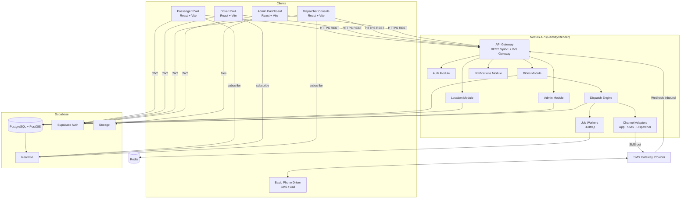
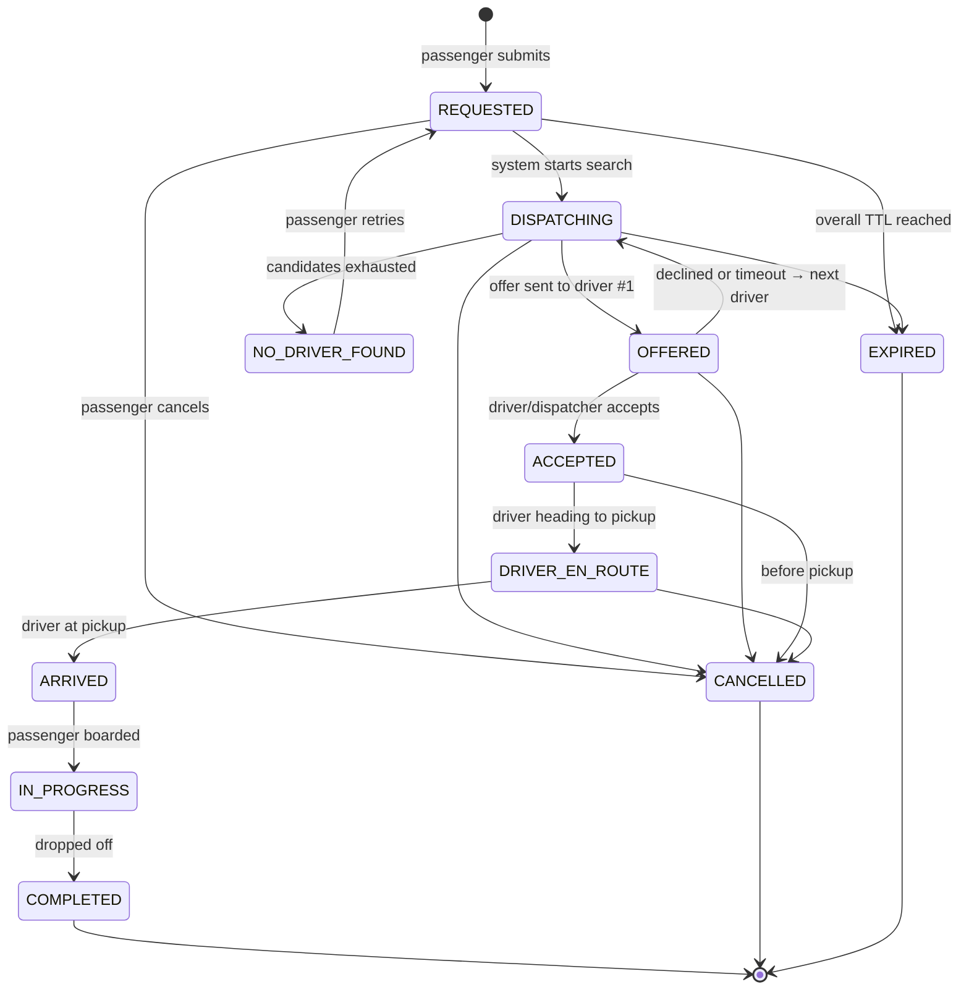
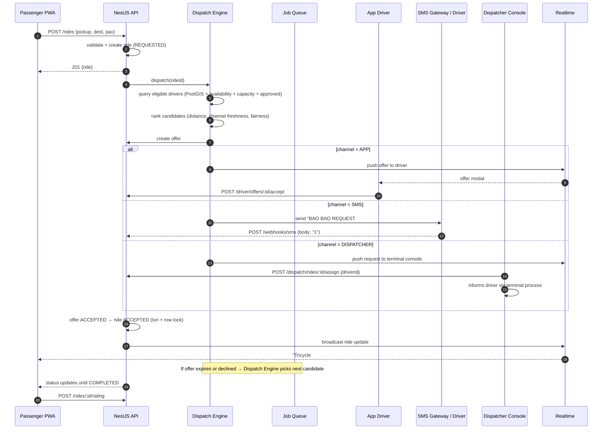
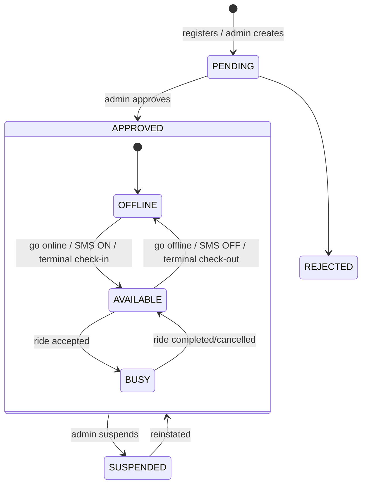
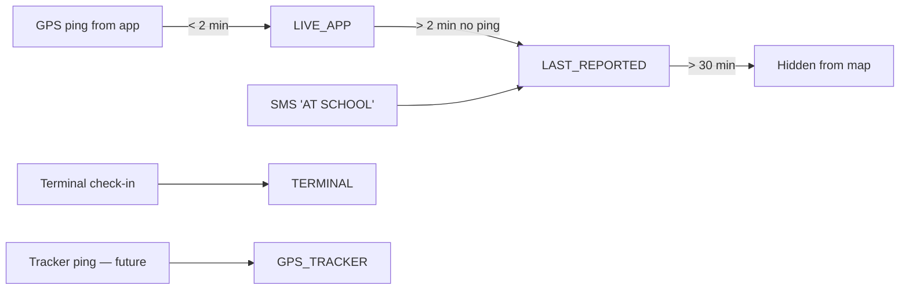

# BAO BAO - Backend Plan

## System Architecture

### High-Level Diagram



### NestJS Module Map

| Module | Responsibility |
|--------|----------------|
| `AuthModule` | JWT guard (Supabase), `RolesGuard`, current-user decorator |
| `UsersModule` | Profiles, roles |
| `DriversModule` | Driver profile, status, approval, channel preference |
| `VehiclesModule` | Vehicles, types, driver–vehicle assignment |
| `TerminalsModule` | Terminals, dispatcher membership, queue/check-in |
| `ZonesModule` | Pickup zones, routes |
| `RidesModule` | Ride request CRUD, state machine, history |
| `DispatchModule` | Candidate search, scoring, offers, timeouts, assignment |
| `ChannelsModule` | `AppChannel`, `SmsChannel`, `DispatcherChannel` adapters |
| `SmsModule` | Provider abstraction, outbound queue, inbound webhook + parser |
| `LocationModule` | Location ingestion, freshness calculation, nearby search |
| `RealtimeModule` | WS gateway / Supabase broadcast helpers |
| `RatingsModule` / `ReportsModule` | Ratings, complaints |
| `AdminModule` | Aggregates, analytics, audit log queries |
| `DemandModule` *(P2)* | Demand snapshots, hotspots, prediction |
| `CommunityModule` *(P3–4)* | Businesses, community reports, BAO Points |

### Request Flow (Layering)

```
Controller → DTO validation → Guard (JWT+Role) → Service → Repository/Prisma → Postgres
                                                     ↓
                                              Domain Events (EventEmitter)
                                                     ↓
                               Realtime broadcast · Notifications · Jobs · Audit
```

## Workflow & Lifecycles

### Ride State Machine



**Transition table (enforced in `RideStateMachine`)**

| From | To | Allowed Actor |
|------|----|---------------|
| REQUESTED | DISPATCHING | SYSTEM |
| DISPATCHING | OFFERED | SYSTEM |
| OFFERED | ACCEPTED | DRIVER (app/SMS), DISPATCHER |
| OFFERED | DISPATCHING | SYSTEM (decline/timeout) |
| DISPATCHING | NO_DRIVER_FOUND | SYSTEM |
| ACCEPTED | DRIVER_EN_ROUTE | DRIVER, DISPATCHER, SYSTEM |
| DRIVER_EN_ROUTE | ARRIVED | DRIVER, DISPATCHER |
| ARRIVED | IN_PROGRESS | DRIVER, DISPATCHER |
| IN_PROGRESS | COMPLETED | DRIVER, DISPATCHER |
| any pre-IN_PROGRESS | CANCELLED | PASSENGER, ADMIN, DISPATCHER |
| REQUESTED/DISPATCHING | EXPIRED | SYSTEM |

Invalid transitions return **409 Conflict** with a clear error code (`RIDE_INVALID_TRANSITION`).

### Dispatch Sequence (all three channels)



### Dispatch Algorithm (MVP)

1. **Eligibility filter:** `approval_status = APPROVED` AND `availability = AVAILABLE` AND vehicle capacity ≥ pax AND not already holding a pending offer AND not previously declined this ride.
2. **Distance:** `ST_DWithin(driver.point, pickup, radius)`; start at 1.5 km, expand to 3 km, then 5 km.
3. **Candidate ranking score:**
   `score = w1·distance + w2·location_staleness_penalty + w3·idle_time_fairness + w4·channel_response_penalty`
   - Terminal drivers rank by **queue position** within their terminal (FIFO) when the pickup is within the terminal's zone.
4. **Offer one at a time** (MVP) with channel-based TTL: APP 20 s · DISPATCHER 60 s · SMS 90 s.
5. **Concurrency safety:** accepting an offer uses `SELECT ... FOR UPDATE` on the ride row; only one offer can win. Late acceptances receive "Request no longer available".
6. **Overall ride TTL:** 10 min → `EXPIRED`/`NO_DRIVER_FOUND`.
7. **Fallback:** if no automated candidate responds, escalate the ride to the **nearest dispatcher console** as a manual-assign request.

### Driver Lifecycle



> Admin/dispatcher can **create SMS and terminal drivers on their behalf** (no app account needed), since those drivers have no `profile_id`.

### Location Freshness Lifecycle



A scheduled job (every 30 s) downgrades stale `LIVE_APP` rows and auto-sets inactive drivers `OFFLINE` after a configurable idle limit.

### Account Lifecycle

`Register → Verify (OTP/email) → Active → (Suspended) → Deactivated`. Drivers add `Approval` between Verify and Active.

## Auth, Roles & Security

### Auth Flow

1. Client signs up/in with **Supabase Auth** (phone OTP and/or email/password).
2. Client calls `POST /auth/sync` → API creates `profiles` row (default role `PASSENGER`).
3. API verifies JWT (via Supabase JWKS / JWT secret) in `SupabaseAuthGuard` and attaches `req.user`.
4. `@Roles('ADMIN')` + `RolesGuard` read the role from `profiles` (not from client-controlled claims).
5. SMS and terminal drivers have **no login**; they exist as `drivers` rows managed by Admin/Dispatcher.

### Security Checklist

- **RLS enabled** on all Supabase tables; the API uses the service role server-side only. Client Realtime subscriptions get read-only RLS policies (e.g. passenger can read only rows where `passenger_id = auth.uid()`).
- Rate limiting via `@nestjs/throttler` (strict on `/rides`, `/driver/location`, webhooks).
- Webhook **signature verification** + IP allowlist for the SMS provider.
- Helmet, CORS allowlist, request size limits.
- Input validation on every DTO (`whitelist: true, forbidNonWhitelisted: true`).
- PII minimization: passenger sees driver first name, driver code, vehicle body no. — **not** phone number.
- Location history retention policy (e.g. 30 days) with a cleanup job.
- Audit log for all admin actions and driver approvals.
- Secrets in environment variables; never in the frontend bundle (only the Supabase anon key).
- Anti-abuse: cooldown after repeated cancellations/no-shows; geofence pickups to the Talibon service area.
- Data Privacy Act (RA 10173) compliance: consent screen, privacy policy, data retention and deletion path.

## Driver Channel Architecture

### Concept

Every driver has a **primary channel**. The dispatch engine doesn't care which; it calls a common interface.

```ts
interface DriverChannel {
  type: 'APP' | 'SMS' | 'DISPATCHER';
  sendOffer(offer: RideOffer): Promise<void>;
  sendRideUpdate(driverId: string, ride: Ride, event: RideEvent): Promise<void>;
}
```

| Channel | Offer delivery | Accept mechanism | Location source | Display label |
|---------|---------------|------------------|-----------------|---------------|
| **APP** | Realtime push + in-app modal | `POST /driver/offers/:id/accept` | GPS stream | LIVE LOCATION |
| **SMS** | SMS via gateway | Inbound webhook reply `1` / `2` | Last SMS `AT <zone>` or last known zone | LAST REPORTED LOCATION |
| **DISPATCHER** | Appears on dispatcher console | Dispatcher clicks Assign / Confirm | Terminal queue membership | TERMINAL AVAILABLE |
| *(future)* **TRACKER** | Any of the above | Any | Device GPS | GPS TRACKED |

### tracking_source Enum (honesty rule)

`LIVE_APP`, `LAST_REPORTED`, `TERMINAL`, `GPS_TRACKER`, `UNKNOWN`

The API **always** returns `tracking_source` and `location_updated_at` with any driver/vehicle position. The UI derives the label from it. A position older than a threshold (e.g. 2 min for LIVE_APP) is downgraded to `LAST_REPORTED` automatically.

### SMS Command Grammar (MVP)

| Inbound text | Meaning |
|--------------|---------|
| `1` | Accept the latest pending offer |
| `2` | Decline the latest pending offer |
| `ON` / `OFF` | Go available / unavailable |
| `AT <ZONECODE>` | Report location zone (e.g. `AT SCHOOL`) |
| `ARRIVED` | Arrived at pickup |
| `START` / `DONE` | Ride started / completed |

Rules: case-insensitive, trimmed, sender matched by `drivers.phone_number`. Unknown text → reply with help text. Offers reference a short code (e.g. `#184`) to avoid ambiguity when multiple offers exist: `1 184`.

## Project Structure

```
bao-bao/
├─ apps/
│  ├─ web/                      # React + Vite
│  │  ├─ src/
│  │  │  ├─ app/                # router, providers
│  │  │  ├─ features/
│  │  │  │  ├─ passenger/
│  │  │  │  ├─ driver/
│  │  │  │  ├─ dispatcher/
│  │  │  │  └─ admin/
│  │  │  ├─ components/ui/
│  │  │  ├─ lib/ (api, supabase, i18n, map)
│  │  │  └─ main.tsx
│  │  └─ vite.config.ts
│  └─ api/                      # NestJS
│     ├─ src/
│     │  ├─ main.ts
│     │  ├─ app.module.ts
│     │  ├─ common/ (guards, filters, pipes, decorators, interceptors)
│     │  ├─ config/
│     │  ├─ modules/
│     │  │  ├─ auth/ users/ drivers/ vehicles/ terminals/ zones/
│     │  │  ├─ rides/ (controller, service, state-machine, dto)
│     │  │  ├─ dispatch/ (engine, scoring, offer.service, jobs)
│     │  │  ├─ channels/ (app.channel.ts, sms.channel.ts, dispatcher.channel.ts)
│     │  │  ├─ sms/ (provider interface, inbound parser, webhook controller)
│     │  │  ├─ location/ realtime/ ratings/ reports/ admin/ notifications/
│     │  └─ prisma/ (schema.prisma, migrations, seed.ts)
│     └─ test/
├─ packages/
│  └─ shared/                   # shared types, enums, zod schemas, constants
├─ supabase/
│  ├─ migrations/               # SQL (PostGIS, RLS policies, triggers)
│  └─ seed.sql
├─ docs/
│  ├─ BAO-BAO-MASTER-PLAN.md
│  └─ api/ (OpenAPI export)
├─ .github/workflows/ci.yml
├─ pnpm-workspace.yaml
└─ README.md
```

**Tooling:** pnpm workspaces · TypeScript strict · ESLint + Prettier · Husky + lint-staged · Conventional Commits.

### Environment variables (API)

```
DATABASE_URL=
DIRECT_URL=
SUPABASE_URL=
SUPABASE_SERVICE_ROLE_KEY=
SUPABASE_JWT_SECRET=
REDIS_URL=
SMS_PROVIDER=semaphore|twilio
SMS_API_KEY=
SMS_SENDER_NAME=BAOBAO
SMS_WEBHOOK_SECRET=
APP_BASE_URL=
CORS_ORIGINS=
OFFER_TTL_APP_SEC=20
OFFER_TTL_DISPATCHER_SEC=60
OFFER_TTL_SMS_SEC=90
RIDE_TTL_MIN=10
```

## Testing Strategy

### Unit Tests
- State machine transitions
- Dispatch scoring algorithm
- SMS command parser
- Domain services
- Guards and pipes

### Integration Tests
- Nest e2e with test Postgres (Docker)
- Ride creation → dispatch → accept via each channel
- SMS webhook processing
- Realtime broadcasting

### Concurrency Tests
- Two drivers accept the same offer simultaneously → exactly one wins
- Multiple ride requests for same driver
- Race conditions in dispatch

### Load Tests
- k6 on `/driver/location` (simulate 200 drivers)
- k6 on `/rides` (50 concurrent requests)
- SMS delivery rate under load

### Field Tests
- Pilot with small number of real drivers per channel
- Real-world network conditions
- SMS delivery verification

## Deployment

### CI/CD Pipeline
- GitHub Actions: lint → typecheck → test → build → deploy
- Prisma migrations run on deploy
- Supabase migrations for RLS/PostGIS
- Environments: local · staging · production

### Hosting
- API: Railway/Render/Fly.io
- Database: Supabase
- Queue: Redis (Upstash or self-hosted)
- SMS: Local PH gateway or Twilio

### Observability
- Structured logs (pino)
- Request IDs for tracing
- Sentry for error tracking
- Uptime check on `/health`
- Metrics dashboard (offer acceptance rate, dispatch latency, SMS delivery rate)
