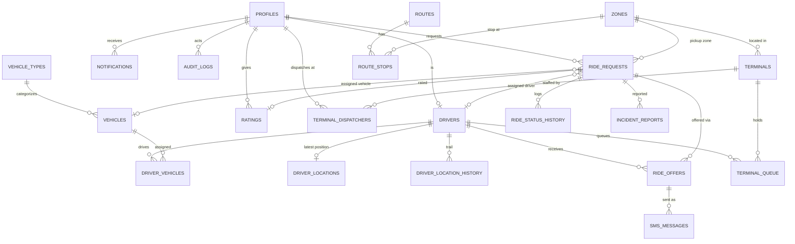

# BAO BAO - Database Schema Plan

## Database Overview

**Database:** PostgreSQL (Supabase)
**Extension:** PostGIS for geospatial queries
**ORM:** Prisma (recommended)
**Schema Version:** 1.0 (MVP)

## Entity Relationship Diagram

### Core Tables (MVP)



## Table Definitions

### PROFILES

User profiles linked to Supabase Auth.

```sql
CREATE TABLE profiles (
    id UUID PRIMARY KEY REFERENCES auth.users(id),
    full_name TEXT NOT NULL,
    phone_number TEXT UNIQUE,
    email TEXT,
    role user_role NOT NULL DEFAULT 'PASSENGER',
    preferred_language TEXT DEFAULT 'en',
    is_active BOOLEAN DEFAULT true,
    created_at TIMESTAMPTZ DEFAULT NOW()
);
```

**Indexes:**
- `idx_profiles_phone ON profiles(phone_number)`
- `idx_profiles_role ON profiles(role)`

### DRIVERS

Driver profiles including SMS-only and terminal-only drivers.

```sql
CREATE TABLE drivers (
    id UUID PRIMARY KEY DEFAULT gen_random_uuid(),
    profile_id UUID REFERENCES profiles(id) ON DELETE SET NULL,
    full_name TEXT NOT NULL,
    phone_number TEXT,
    license_no TEXT,
    primary_channel driver_channel NOT NULL DEFAULT 'APP',
    approval_status approval_status NOT NULL DEFAULT 'PENDING',
    availability driver_availability NOT NULL DEFAULT 'OFFLINE',
    driver_code TEXT UNIQUE NOT NULL,
    home_terminal_id UUID REFERENCES terminals(id),
    created_at TIMESTAMPTZ DEFAULT NOW()
);
```

**Indexes:**
- `idx_drivers_code ON drivers(driver_code)`
- `idx_drivers_phone ON drivers(phone_number)`
- `idx_drivers_status ON drivers(approval_status, availability)`
- `idx_drivers_channel ON drivers(primary_channel)`

### VEHICLE_TYPES

Types of vehicles (tricycle, bao bao, etc.).

```sql
CREATE TABLE vehicle_types (
    id UUID PRIMARY KEY DEFAULT gen_random_uuid(),
    code TEXT UNIQUE NOT NULL,
    name TEXT NOT NULL,
    default_capacity INTEGER NOT NULL DEFAULT 4
);
```

### VEHICLES

Vehicle registry.

```sql
CREATE TABLE vehicles (
    id UUID PRIMARY KEY DEFAULT gen_random_uuid(),
    vehicle_type_id UUID NOT NULL REFERENCES vehicle_types(id),
    plate_or_body_no TEXT UNIQUE NOT NULL,
    capacity INTEGER NOT NULL,
    approval_status approval_status NOT NULL DEFAULT 'PENDING',
    photo_url TEXT,
    is_active BOOLEAN DEFAULT true
);
```

**Indexes:**
- `idx_vehicles_plate ON vehicles(plate_or_body_no)`
- `idx_vehicles_type ON vehicles(vehicle_type_id)`
- `idx_vehicles_status ON vehicles(approval_status, is_active)`

### DRIVER_VEHICLES

Association between drivers and vehicles.

```sql
CREATE TABLE driver_vehicles (
    id UUID PRIMARY KEY DEFAULT gen_random_uuid(),
    driver_id UUID NOT NULL REFERENCES drivers(id) ON DELETE CASCADE,
    vehicle_id UUID NOT NULL REFERENCES vehicles(id) ON DELETE CASCADE,
    is_current BOOLEAN DEFAULT true,
    assigned_at TIMESTAMPTZ DEFAULT NOW()
);
```

**Indexes:**
- `uq_driver_current_vehicle UNIQUE(driver_id) WHERE is_current`
- `idx_driver_vehicles_driver ON driver_vehicles(driver_id)`

### DRIVER_LOCATIONS

Current location of each driver.

```sql
CREATE TABLE driver_locations (
    driver_id UUID PRIMARY KEY REFERENCES drivers(id) ON DELETE CASCADE,
    point GEOGRAPHY(POINT, 4326) NOT NULL,
    tracking_source tracking_source NOT NULL DEFAULT 'UNKNOWN',
    last_zone_id UUID REFERENCES zones(id),
    updated_at TIMESTAMPTZ DEFAULT NOW()
);
```

**Indexes:**
- `idx_driver_locations_point ON driver_locations USING GIST (point)`
- `idx_driver_locations_updated ON driver_locations(updated_at)`

### DRIVER_LOCATION_HISTORY

Historical trail of driver locations.

```sql
CREATE TABLE driver_location_history (
    id BIGSERIAL PRIMARY KEY,
    driver_id UUID NOT NULL REFERENCES drivers(id) ON DELETE CASCADE,
    point GEOGRAPHY(POINT, 4326) NOT NULL,
    tracking_source tracking_source NOT NULL,
    recorded_at TIMESTAMPTZ DEFAULT NOW()
);
```

**Indexes:**
- `idx_location_history_driver ON driver_location_history(driver_id, recorded_at DESC)`
- `idx_location_history_point ON driver_location_history USING GIST (point)`

### TERMINALS

Physical terminal locations.

```sql
CREATE TABLE terminals (
    id UUID PRIMARY KEY DEFAULT gen_random_uuid(),
    name TEXT NOT NULL,
    zone_id UUID NOT NULL REFERENCES zones(id),
    point GEOGRAPHY(POINT, 4326) NOT NULL,
    is_active BOOLEAN DEFAULT true
);
```

**Indexes:**
- `idx_terminals_zone ON terminals(zone_id)`
- `idx_terminals_active ON terminals(is_active)`

### TERMINAL_DISPATCHERS

Dispatcher-to-terminal assignment.

```sql
CREATE TABLE terminal_dispatchers (
    id UUID PRIMARY KEY DEFAULT gen_random_uuid(),
    terminal_id UUID NOT NULL REFERENCES terminals(id) ON DELETE CASCADE,
    profile_id UUID NOT NULL REFERENCES profiles(id) ON DELETE CASCADE
);
```

**Indexes:**
- `idx_terminal_dispatchers_terminal ON terminal_dispatchers(terminal_id)`
- `idx_terminal_dispatchers_profile ON terminal_dispatchers(profile_id)`

### TERMINAL_QUEUE

Driver queue at terminals.

```sql
CREATE TABLE terminal_queue (
    id UUID PRIMARY KEY DEFAULT gen_random_uuid(),
    terminal_id UUID NOT NULL REFERENCES terminals(id) ON DELETE CASCADE,
    driver_id UUID NOT NULL REFERENCES drivers(id) ON DELETE CASCADE,
    position INTEGER NOT NULL,
    checked_in_at TIMESTAMPTZ DEFAULT NOW(),
    checked_out_at TIMESTAMPTZ
);
```

**Indexes:**
- `idx_terminal_queue_terminal ON terminal_queue(terminal_id, position)`
- `idx_terminal_queue_driver ON terminal_queue(driver_id)`

### ZONES

Pickup zones, terminals, and areas.

```sql
CREATE TABLE zones (
    id UUID PRIMARY KEY DEFAULT gen_random_uuid(),
    code TEXT UNIQUE NOT NULL,
    name TEXT NOT NULL,
    zone_type TEXT NOT NULL, -- 'PICKUP' | 'TERMINAL' | 'AREA'
    center GEOGRAPHY(POINT, 4326) NOT NULL,
    boundary GEOGRAPHY(POLYGON, 4326),
    is_active BOOLEAN DEFAULT true
);
```

**Indexes:**
- `idx_zones_code ON zones(code)`
- `idx_zones_type ON zones(zone_type)`
- `idx_zones_active ON zones(is_active)`
- `idx_zones_center ON zones USING GIST (center)`

### ROUTES

Named routes with multiple stops.

```sql
CREATE TABLE routes (
    id UUID PRIMARY KEY DEFAULT gen_random_uuid(),
    name TEXT NOT NULL,
    is_active BOOLEAN DEFAULT true
);
```

### ROUTE_STOPS

Stops along a route.

```sql
CREATE TABLE route_stops (
    id UUID PRIMARY KEY DEFAULT gen_random_uuid(),
    route_id UUID NOT NULL REFERENCES routes(id) ON DELETE CASCADE,
    zone_id UUID NOT NULL REFERENCES zones(id) ON DELETE CASCADE,
    stop_order INTEGER NOT NULL
);
```

**Indexes:**
- `idx_route_stops_route ON route_stops(route_id, stop_order)`

### RIDE_REQUESTS

Core ride request entity.

```sql
CREATE TABLE ride_requests (
    id UUID PRIMARY KEY DEFAULT gen_random_uuid(),
    public_code TEXT UNIQUE NOT NULL,
    passenger_id UUID NOT NULL REFERENCES profiles(id) ON DELETE CASCADE,
    passenger_count INTEGER NOT NULL,
    pickup_point GEOGRAPHY(POINT, 4326) NOT NULL,
    pickup_label TEXT NOT NULL,
    pickup_zone_id UUID REFERENCES zones(id),
    destination_point GEOGRAPHY(POINT, 4326) NOT NULL,
    destination_label TEXT NOT NULL,
    status ride_status NOT NULL DEFAULT 'REQUESTED',
    driver_id UUID REFERENCES drivers(id) ON DELETE SET NULL,
    vehicle_id UUID REFERENCES vehicles(id) ON DELETE SET NULL,
    channel_used TEXT NOT NULL,
    eta_minutes INTEGER,
    cancel_reason TEXT,
    requested_at TIMESTAMPTZ DEFAULT NOW(),
    expires_at TIMESTAMPTZ,
    accepted_at TIMESTAMPTZ,
    picked_up_at TIMESTAMPTZ,
    completed_at TIMESTAMPTZ
);
```

**Indexes:**
- `idx_ride_pickup_point ON ride_requests USING GIST (pickup_point)`
- `idx_ride_status ON ride_requests(status, requested_at DESC)`
- `idx_ride_passenger ON ride_requests(passenger_id, requested_at DESC)`
- `uq_one_active_ride_per_passenger UNIQUE(passenger_id) WHERE status IN ('REQUESTED','DISPATCHING','OFFERED','ACCEPTED','DRIVER_EN_ROUTE','ARRIVED','IN_PROGRESS')`

### RIDE_OFFERS

Offers sent to drivers for a ride.

```sql
CREATE TABLE ride_offers (
    id UUID PRIMARY KEY DEFAULT gen_random_uuid(),
    ride_id UUID NOT NULL REFERENCES ride_requests(id) ON DELETE CASCADE,
    driver_id UUID NOT NULL REFERENCES drivers(id) ON DELETE CASCADE,
    channel TEXT NOT NULL,
    status offer_status NOT NULL DEFAULT 'PENDING',
    sequence INTEGER NOT NULL,
    offered_at TIMESTAMPTZ DEFAULT NOW(),
    expires_at TIMESTAMPTZ NOT NULL,
    responded_at TIMESTAMPTZ,
    responded_by UUID REFERENCES profiles(id)
);
```

**Indexes:**
- `idx_offers_ride ON ride_offers(ride_id, sequence)`
- `idx_offers_driver_pending ON ride_offers(driver_id) WHERE status = 'PENDING'`

### RIDE_STATUS_HISTORY

Audit trail of ride status changes.

```sql
CREATE TABLE ride_status_history (
    id BIGSERIAL PRIMARY KEY,
    ride_id UUID NOT NULL REFERENCES ride_requests(id) ON DELETE CASCADE,
    from_status ride_status,
    to_status ride_status NOT NULL,
    actor_profile_id UUID REFERENCES profiles(id),
    actor_type TEXT NOT NULL, -- 'PASSENGER' | 'DRIVER' | 'DISPATCHER' | 'ADMIN' | 'SYSTEM' | 'SMS'
    meta JSONB,
    created_at TIMESTAMPTZ DEFAULT NOW()
);
```

**Indexes:**
- `idx_status_history_ride ON ride_status_history(ride_id, created_at DESC)`

### SMS_MESSAGES

SMS log for audit and debugging.

```sql
CREATE TABLE sms_messages (
    id UUID PRIMARY KEY DEFAULT gen_random_uuid(),
    direction TEXT NOT NULL, -- 'OUT' | 'IN'
    phone_number TEXT NOT NULL,
    body TEXT NOT NULL,
    ride_offer_id UUID REFERENCES ride_offers(id) ON DELETE SET NULL,
    status TEXT NOT NULL, -- 'QUEUED' | 'SENT' | 'DELIVERED' | 'FAILED' | 'RECEIVED'
    provider_message_id TEXT,
    created_at TIMESTAMPTZ DEFAULT NOW()
);
```

**Indexes:**
- `idx_sms_phone ON sms_messages(phone_number, created_at DESC)`
- `idx_sms_offer ON sms_messages(ride_offer_id)`

### RATINGS

Ride ratings.

```sql
CREATE TABLE ratings (
    id UUID PRIMARY KEY DEFAULT gen_random_uuid(),
    ride_id UUID NOT NULL UNIQUE REFERENCES ride_requests(id) ON DELETE CASCADE,
    passenger_id UUID NOT NULL REFERENCES profiles(id) ON DELETE CASCADE,
    driver_id UUID NOT NULL REFERENCES drivers(id) ON DELETE CASCADE,
    score INTEGER NOT NULL CHECK (score >= 1 AND score <= 5),
    comment TEXT,
    created_at TIMESTAMPTZ DEFAULT NOW()
);
```

**Indexes:**
- `idx_ratings_ride ON ratings(ride_id)`
- `idx_ratings_driver ON ratings(driver_id, created_at DESC)`

### INCIDENT_REPORTS

Incident and complaint reports.

```sql
CREATE TABLE incident_reports (
    id UUID PRIMARY KEY DEFAULT gen_random_uuid(),
    ride_id UUID NOT NULL REFERENCES ride_requests(id) ON DELETE CASCADE,
    reporter_id UUID NOT NULL REFERENCES profiles(id) ON DELETE CASCADE,
    category TEXT NOT NULL,
    description TEXT NOT NULL,
    status TEXT NOT NULL DEFAULT 'OPEN', -- 'OPEN' | 'REVIEWING' | 'RESOLVED'
    created_at TIMESTAMPTZ DEFAULT NOW()
);
```

**Indexes:**
- `idx_reports_ride ON incident_reports(ride_id)`
- `idx_reports_status ON incident_reports(status)`

### NOTIFICATIONS

User notifications.

```sql
CREATE TABLE notifications (
    id UUID PRIMARY KEY DEFAULT gen_random_uuid(),
    profile_id UUID NOT NULL REFERENCES profiles(id) ON DELETE CASCADE,
    type TEXT NOT NULL,
    payload JSONB NOT NULL,
    is_read BOOLEAN DEFAULT false,
    created_at TIMESTAMPTZ DEFAULT NOW()
);
```

**Indexes:**
- `idx_notifications_profile ON notifications(profile_id, created_at DESC)`
- `idx_notifications_unread ON notifications(profile_id) WHERE is_read = false`

### AUDIT_LOGS

System audit trail.

```sql
CREATE TABLE audit_logs (
    id BIGSERIAL PRIMARY KEY,
    actor_id UUID REFERENCES profiles(id) ON DELETE SET NULL,
    action TEXT NOT NULL,
    entity TEXT NOT NULL,
    entity_id UUID,
    diff JSONB,
    created_at TIMESTAMPTZ DEFAULT NOW()
);
```

**Indexes:**
- `idx_audit_actor ON audit_logs(actor_id, created_at DESC)`
- `idx_audit_entity ON audit_logs(entity, entity_id)`

## Phase 2+ Tables (Future)

### DEMAND_SNAPSHOTS

```sql
CREATE TABLE demand_snapshots (
    id BIGSERIAL PRIMARY KEY,
    zone_id UUID NOT NULL REFERENCES zones(id) ON DELETE CASCADE,
    waiting_count INTEGER NOT NULL,
    available_vehicles INTEGER NOT NULL,
    captured_at TIMESTAMPTZ DEFAULT NOW()
);
```

### BUSINESSES

```sql
CREATE TABLE businesses (
    id UUID PRIMARY KEY DEFAULT gen_random_uuid(),
    owner_id UUID NOT NULL REFERENCES profiles(id) ON DELETE CASCADE,
    name TEXT NOT NULL,
    category TEXT NOT NULL,
    point GEOGRAPHY(POINT, 4326) NOT NULL,
    is_verified BOOLEAN DEFAULT false
);
```

### BUSINESS_ITEMS

```sql
CREATE TABLE business_items (
    id UUID PRIMARY KEY DEFAULT gen_random_uuid(),
    business_id UUID NOT NULL REFERENCES businesses(id) ON DELETE CASCADE,
    name TEXT NOT NULL,
    price NUMERIC NOT NULL
);
```

### COMMUNITY_REPORTS

```sql
CREATE TABLE community_reports (
    id UUID PRIMARY KEY DEFAULT gen_random_uuid(),
    reporter_id UUID NOT NULL REFERENCES profiles(id) ON DELETE CASCADE,
    type TEXT NOT NULL, -- 'FLOOD' | 'ROAD_HAZARD' | 'STREETLIGHT' | 'DUMPING' | 'TRAFFIC'
    point GEOGRAPHY(POINT, 4326) NOT NULL,
    status TEXT NOT NULL DEFAULT 'PENDING', -- 'PENDING' | 'VERIFIED' | 'REJECTED' | 'RESOLVED'
    photo_url TEXT,
    created_at TIMESTAMPTZ DEFAULT NOW()
);
```

### BAO_POINTS_LEDGER

```sql
CREATE TABLE bao_points_ledger (
    id BIGSERIAL PRIMARY KEY,
    profile_id UUID NOT NULL REFERENCES profiles(id) ON DELETE CASCADE,
    source_report_id UUID REFERENCES community_reports(id) ON DELETE SET NULL,
    points INTEGER NOT NULL,
    reason TEXT NOT NULL,
    created_at TIMESTAMPTZ DEFAULT NOW()
);
```

### DELIVERY_REQUESTS

```sql
CREATE TABLE delivery_requests (
    id UUID PRIMARY KEY DEFAULT gen_random_uuid(),
    requester_id UUID NOT NULL REFERENCES profiles(id) ON DELETE CASCADE,
    ride_id UUID REFERENCES ride_requests(id) ON DELETE SET NULL,
    pickup_point GEOGRAPHY(POINT, 4326) NOT NULL,
    dropoff_point GEOGRAPHY(POINT, 4326) NOT NULL,
    status TEXT NOT NULL DEFAULT 'PENDING'
);
```

## Enums

```sql
CREATE TYPE ride_status AS ENUM (
  'REQUESTED','DISPATCHING','OFFERED','ACCEPTED','DRIVER_EN_ROUTE',
  'ARRIVED','IN_PROGRESS','COMPLETED','CANCELLED','EXPIRED','NO_DRIVER_FOUND'
);

CREATE TYPE driver_channel AS ENUM ('APP','SMS','DISPATCHER');

CREATE TYPE tracking_source AS ENUM ('LIVE_APP','LAST_REPORTED','TERMINAL','GPS_TRACKER','UNKNOWN');

CREATE TYPE approval_status AS ENUM ('PENDING','APPROVED','SUSPENDED','REJECTED');

CREATE TYPE driver_availability AS ENUM ('OFFLINE','AVAILABLE','BUSY');

CREATE TYPE offer_status AS ENUM ('PENDING','ACCEPTED','DECLINED','EXPIRED','CANCELLED');

CREATE TYPE user_role AS ENUM ('PASSENGER','DRIVER','DISPATCHER','ADMIN');
```

## Database Extensions

```sql
CREATE EXTENSION IF NOT EXISTS postgis;
CREATE EXTENSION IF NOT EXISTS pgcrypto;
```

## Indexes Summary

### Performance-Critical Indexes

1. **Spatial Indexes** (PostGIS GiST)
   - `driver_locations.point` - for nearby driver queries
   - `ride_requests.pickup_point` - for pickup location queries
   - `zones.center` - for zone-based queries

2. **Status Indexes**
   - `ride_requests(status, requested_at DESC)` - for active ride queries
   - `drivers(approval_status, availability)` - for driver eligibility
   - `ride_offers(driver_id) WHERE status = 'PENDING'` - for pending offers

3. **Constraint Indexes**
   - `ride_requests(passenger_id)` - partial unique for one active ride
   - `driver_vehicles(driver_id) WHERE is_current` - one current vehicle
   - `profiles(phone_number)` - unique phone numbers

## Row-Level Security (RLS) Policies

### Example RLS Policies

```sql
-- Enable RLS
ALTER TABLE ride_requests ENABLE ROW LEVEL SECURITY;

-- Passengers can only see their own rides
CREATE POLICY ride_requests_passenger_own
  ON ride_requests FOR SELECT
  USING (passenger_id = auth.uid());

-- Drivers can see rides assigned to them
CREATE POLICY ride_requests_driver_assigned
  ON ride_requests FOR SELECT
  USING (driver_id IN (SELECT id FROM drivers WHERE profile_id = auth.uid()));

-- Dispatchers can see rides for their terminals
CREATE POLICY ride_requests_dispatcher_terminal
  ON ride_requests FOR SELECT
  USING (
    EXISTS (
      SELECT 1 FROM terminal_dispatchers td
      JOIN terminals t ON td.terminal_id = t.id
      WHERE td.profile_id = auth.uid()
      AND t.zone_id = ride_requests.pickup_zone_id
    )
  );

-- Admins can see all rides
CREATE POLICY ride_requests_admin_all
  ON ride_requests FOR ALL
  USING (
    EXISTS (
      SELECT 1 FROM profiles
      WHERE id = auth.uid() AND role = 'ADMIN'
    )
  );
```

## Migration Strategy

### Migration Order

1. Create extensions (PostGIS, pgcrypto)
2. Create enums
3. Create core tables (profiles, vehicle_types, zones, routes)
4. Create reference tables (vehicles, terminals)
4. Create entity tables (drivers, driver_vehicles)
5. Create operational tables (driver_locations, ride_requests, ride_offers)
6. Create audit/history tables (ride_status_history, audit_logs, sms_messages)
7. Create feature tables (ratings, incident_reports, notifications)
8. Create indexes
9. Enable RLS policies
10. Seed data (zones, terminals, vehicle types)

### Seed Data

**Vehicle Types:**
- TRICYCLE (capacity: 4)
- BAO_BAO (capacity: 6)
- OTHER (capacity: 4)

**Zones (Talibon):**
- SCHOOL (pickup zone)
- MARKET (pickup zone)
- POBLACION (pickup zone)
- TERMINAL_1 (terminal zone)
- TERMINAL_2 (terminal zone)

**Terminals:**
- Main Terminal
- School Terminal
- Market Terminal

## Data Retention Policies

### Cleanup Jobs

**Location History:**
- Retain: 30 days
- Cleanup job: Daily at 2 AM

**SMS Messages:**
- Retain: 90 days
- Cleanup job: Weekly

**Audit Logs:**
- Retain: 1 year
- Cleanup job: Monthly

**Ride Status History:**
- Retain: 1 year
- Cleanup job: Monthly

## Backup Strategy

- Daily automated backups via Supabase
- Point-in-time recovery (7 days)
- Weekly backup verification
- Export before major schema changes
